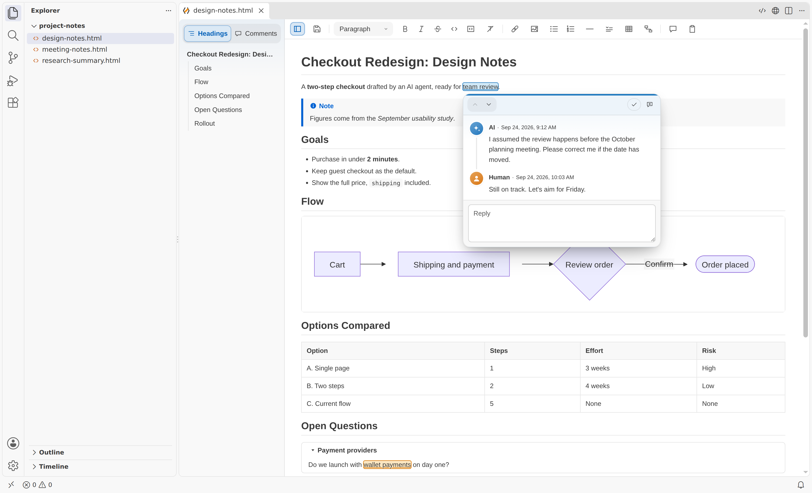
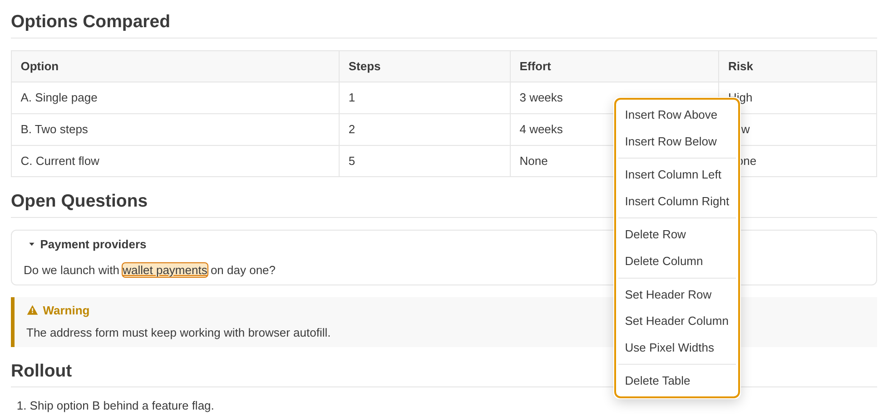
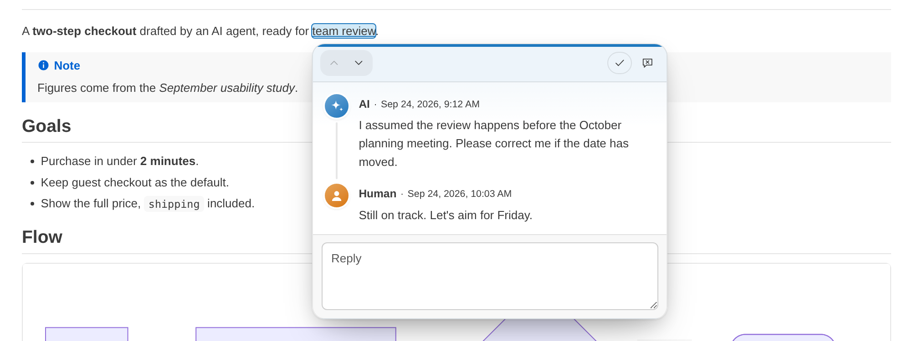
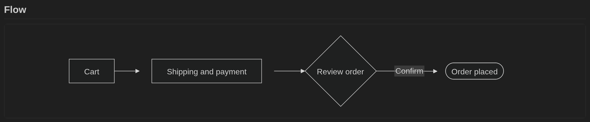

<div align="center">


<p>
  <a href="https://marketplace.visualstudio.com/items?itemName=YuyaMiyamoto.agentic-html-visual-editor"></a>
  
  <a href="LICENSE"></a>
</p>

<p><a href="README.md">English</a> | <strong>日本語</strong></p>

</div>

Agentic HTML Visual Editor は、VS Code で **`.html` ファイルを WYSIWYG で編集する**拡張機能です。ディスク上の素の HTML ファイルが、AI エージェントと人間のどちらも読み書きする唯一の情報源になります。エージェントは小さく正しい HTML を書き、人間はマークアップに触れずに、読みやすい画面で編集とレビューをします。

<p align="center">
  
  <br />
  <em>HTML ファイルを文書のように編集できます。人間と AI エージェントのレビューコメントは、ファイルそのものに残ります。</em>
</p>

---

## 📑 目次

- [✨ この拡張機能を使う理由](#-この拡張機能を使う理由)
- [🚀 はじめに](#-はじめに)
- [🤖 Agent Skill](#-agent-skill)
- [👀 機能の一覧](#-機能の一覧)
- [🧩 機能の詳細](#-機能の詳細)
- [⚡ キーボードショートカット](#-キーボードショートカット)
- [💻 動作環境](#-動作環境)
- [🚫 既知の制約](#-既知の制約)
- [📝 変更履歴](#-変更履歴)
- [📄 ライセンス](#-ライセンス)

---

## ✨ この拡張機能を使う理由

設計メモ・調査レポート・タスクリストのような成果物を AI エージェントと人間が一緒に扱うとき、Markdown では凝ったレイアウトが保てません。かといって、多機能な HTML エディタは重くて煩雑です。この拡張機能は、その中間を狙っています。

- **エージェント**：小さく正しい HTML を書くだけで済み、出力も短くなります。
- **人間**：HTML を知らなくても、読みやすい画面で編集とレビューができます。
- **ファイル**：中間形式やサイドカーファイルはなく、レビューコメントを含めて HTML だけで完結します。そのまま持ち運べます。

典型的なやり取りは次のとおりです。

1. AI エージェントが成果物を `.html` ファイルとして書きます。このエディタ向けの書き方は [Agent Skill](#-agent-skill) にまとまっています。
2. 人間はそのファイルを WYSIWYG の画面で開き、編集して、レビューコメントを付けます。
3. エージェントは、編集とコメントを HTML から直接読み取り、同じスレッドに返信します。

## 🚀 はじめに

1. `.html` ファイルを開きます。この拡張機能は既定のエディタを置き換えないので、これまでどおり標準のテキストエディタで開きます。
2. エディタのタイトルバーの **WYSIWYG で開く** を押すか、コマンドパレットから **Visual Editor: WYSIWYG で開く** を実行します。タブは同じエディタグループのまま、WYSIWYG の画面に置き換わります。
3. 編集したら `Ctrl+S`（macOS では `Cmd+S`）で保存します。元に戻す・やり直しはいつものキーで使え、保存をはさんでも効きます。
4. HTML に戻すには、タイトルバーの **HTML で開く** を押します。

`.html` ファイルを毎回 WYSIWYG で開きたいときは、**エディターを再度開く…** から **'*.html' の既定のエディターを構成…** を選びます。

## 🤖 Agent Skill

このリポジトリには Agent Skill が入っています。AI エージェントに、このエディタ向けの HTML の書き方とレビューコメントの扱い方を教えるものです。次のコマンドで導入します。

```
npx skills add Ymmy833y/Agentic-HTML-Visual-Editor
```

導入されるのは `agentic-html-visual-editor-authoring` というスキルです。このスキルには、文書のコメントを一覧にするスクリプトが付いていて、動かすには Python 3.11 以上が必要です。

## 👀 機能の一覧

| 領域 | できること |
| --- | --- |
| 🔠 **書式** | 太字、斜体、取り消し線、インラインコード、リンク。見出し、段落、引用、コードブロック |
| ✅ **リスト** | 箇条書きと番号付きリスト。`Tab` と `Shift+Tab` で階層を上げ下げ |
| 🧮 **表** | グリッドからの挿入、行と列、ヘッダーセル、セルの結合、px か % の列幅 |
| 🔽 **折りたたみ** | 画面上で実際に開閉でき、状態も保存される `<details>` |
| 💡 **アラート** | GitHub 風の引用（note・tip・important・warning・caution） |
| 💬 **レビューコメント** | HTML の中に残るスレッド。書いた人と日時、解決済みかどうかも記録 |
| 🔗 **リンクと画像** | ダイアログでの挿入と編集。`Ctrl`+クリックでリンクを開く |
| 📊 **Mermaid の図** | VS Code のテーマに合わせて表示し、ファイルにはソースを残す |
| 🔍 **検索** | `Ctrl+F` で検索。大文字小文字の区別、単語単位、コメント ID での検索 |
| 🧭 **サイドバー** | 見出しの一覧と、コメントスレッドの一覧 |
| 📋 **クリップボード** | きれいな HTML でのコピー、余計なスタイルを除いた貼り付け、コードブロックのコピーボタン |
| 💾 **壊さない保存** | 編集していない行はそのまま残し、ディスク上の変更とは行単位でマージ |
| ⏪ **元に戻す操作と復旧** | 保存後も使える元に戻す・やり直し。再読み込みや再起動のあとも残る未保存の編集 |
| 🌐 **言語とアクセシビリティ** | 英語と日本語の表示。キーボードだけで操作可能 |

## 🧩 機能の詳細

### 🔠 書式とブロック

- 太字、斜体、取り消し線、インラインコード、リンクは、ツールバーから付けられます。取り消し線以外の 4 つは、選択範囲の上に出るフローティングメニューにもあります。太字・斜体・リンクにはキーボードショートカットもあります。**書式のクリア** は、選択範囲のインライン書式をまとめて外します。
- **ブロックの種類** のメニューで、見出し 1〜6、段落、引用、コードブロックを相互に変換できます。
- ブロックの先頭で `## ` と打てば見出し、`- ` と打てば箇条書きになるなど、Markdown 風の入力で書式を付けられます。一覧は [キーボードショートカット](#-キーボードショートカット) にあります。
- コードブロックの末尾の空行で `Enter` を押すと、ブロックを抜けて新しい段落に移ります。
- 同梱のスタイルシートのおかげで、素の HTML でも最初から整った見た目になります。ファイルに書かれた `style` 属性は、このスタイルシートより優先されます。

### ✅ リスト

- 箇条書きと番号付きリストを作り、種類を切り替え、段落へ戻せます。
- `Tab` で項目を 1 つ前の項目の下に入れ、`Shift+Tab` で 1 段戻します。最上位の項目では、段落になります。空の項目で `Enter` を押すと、リストを抜けます。
- 選択範囲をまとめて変換すると、範囲に含まれるブロックはすべて変わります。またいでいるだけの表やコードブロックなどは、そのまま残ります。
- 同じ種類のリストの隣で変換すると、そのリストに合流し、番号も続きます。

### 🧮 表

<p align="center">
  
  <br />
  <em>セルを右クリックすると、表の操作メニューが開きます。</em>
</p>

- グリッドから大きさを選んで、表を挿入できます。
- 行と列を追加・削除でき、ヘッダー行とヘッダー列も切り替えられます。`th` と `scope` も正しく付け替えます。
- セルの結合と分割ができます。`Shift`+クリックで選んだ長方形の範囲も、まとめて結合できます。
- 列の境界をドラッグすると、px か % で列幅を変えられます。
- `Tab` と `Shift+Tab` でセル間を移動します。セルの中でも、ブロックの書式とリストが使えます。
- 表の操作はコンテキストメニューにまとまっています。キーボードでは `Shift+F10` かメニューキーで開きます。

### 🔽 折りたたみ

- ツールバーから `<details>` / `<summary>` の折りたたみを挿入できます。画面上で実際に開閉でき、その状態は HTML に保存されます。
- 左端の印を押すと開閉します。タイトルの文字を押すと、タイトルを編集できます。編集中に `Enter` を押すと、キャレットが本文に移ります。

### 💡 アラート

- note・tip・important・warning・caution の引用は、`<blockquote data-alert="…">` として保存されます。ラベル、アイコン、色は画面で描画するだけで、ファイルには書き込みません。
- **ブロックの種類** のメニューから選べるほか、ブロックの先頭で `>note`・`>tip`・`>important`・`>warning`・`>caution` のどれかと空白を打っても作れます。
- 対応していない種別の値はファイルにそのまま残し、ふつうの引用として表示します。

### 💬 レビューコメント

<p align="center">
  
  <br />
  <em>AI エージェントと人間のやり取りが、スレッドとして HTML の中にそのまま残ります。</em>
</p>

- `<comment>` の注釈は HTML の中にあるので、人間でも AI でも、マークアップからスレッド全体を読めます。
- 文字を選び、ツールバーからコメントを付けます。色の付いた文字を押すと、そのスレッドが開きます。
- 本文と返信は、追加・編集・削除ができます。書き込みごとに書いた人と日時が記録され、アバターの色で人間と AI エージェントの書き込みを見分けられます。
- スレッドは解決済みにでき、解決済みのスレッドは目立たない表示になります。
- AI エージェントの書き込みを編集・削除するときは、先に確認のダイアログが出ます。
- ポップアップから、前後のスレッドに移動できます。
- コメントの周りの文字を消しても、表示されていない本文と返信は巻き添えで消えません。周りを編集しても、コメントは丸ごと保たれます。

### 🔗 リンクと画像

- ダイアログでリンクと画像を挿入・編集できます。`Enter` で確定し、`Esc` で取り消します。
- リンクは `Ctrl`+クリック（macOS では `Cmd`+クリック）で開きます。ふつうのクリックでは、リンクの文字をそのまま編集できます。
- ローカルのファイルへの相対リンクは、この HTML ファイルが属するワークスペースフォルダの中を指していれば、VS Code のタブで開きます。まず HTML ファイルのあるフォルダから解決し、そこに無ければワークスペースフォルダから解決します。

### 📊 Mermaid の図

<p align="center">
  
  <br />
  <em>図は VS Code のテーマに合わせて描かれます。画像はダークテーマの例です。</em>
</p>

- `<pre class="mermaid">` と `<pre><code class="language-mermaid">` のブロックは、ライトテーマとダークテーマに合わせた図として表示されます。
- ツールバーから図を挿入できます。既存の図を押すと、ダイアログでソースを編集できます。
- ファイルに残るのはソースだけで、描画した図は保存しません。構文に誤りがあるとエラーが表示されますが、ソースは引き続き編集できます。

### 🔍 検索

- `Ctrl+F` で検索パネルが開きます。一致した箇所をすべて強調表示し、`7 件中 2 件` のように現在の位置を示します。
- `Enter` で次の一致、`Shift+Enter` で前の一致に移ります。`Esc` でパネルを閉じると、キャレットは現在の一致の位置に残ります。
- 大文字と小文字の区別、単語単位の一致を切り替えられます。文字を選択した状態でパネルを開くと、その文字が最初から検索語に入ります。
- 検索の対象は、見えている文字とコメントの ID です。`id` に一致したときは、そのコメントに移動してスレッドを開きます。
- 強調表示が、文書や保存される HTML を書き換えることはありません。

### 🧭 サイドバー

- 画面の左端のサイドバーに、見出しが階層つきで、コメントスレッドが文書の順に並びます。スレッドには、最初に書いた人の色の点が付き、解決済みになるとチェックの印に変わります。
- 項目を選ぶと、その位置に移動します。サイドバーは、ツールバー左端のボタンで開閉します。

### 📋 クリップボード

- コピーと切り取りでは、コメントの付属情報を含まないきれいな HTML が書き出され、注釈を付けた文字だけが残ります。
- Office、Google ドキュメント、ブラウザからの貼り付けでは、それぞれ固有の目印と計算済みのスタイルが取り除かれ、意味のあるスタイル（文字色、背景色、行揃え、表と画像の寸法）だけが残ります。`Ctrl+Shift+V` なら、プレーンテキストとして貼り付けます。
- **HTML としてコピー** は、選択範囲をコピーします。何も選択していなければ、本文全体をコピーします。
- コードブロックにポインターを重ねるとコピーボタンが表示され、コードをプレーンテキストでコピーできます。

### 💾 壊さない保存

- 編集していない行は、空白、属性の引用符、タグの大文字小文字、空要素の書き方まで含めて、ディスク上のとおりに残ります。
- 編集中にディスク上のファイルが変わった場合も、保存のときに双方の変更を行単位でマージします。
- イベントハンドラ属性と危険な URL は、画面の中でだけ無効にし、保存のときは元のとおりに書き戻します。
- UTF-8 以外の文字コードのファイルも、文字を壊さずに開き、UTF-8 で保存します。

### ⏪ 元に戻す操作と復旧

- 元に戻す・やり直しは保存をまたいで効き、キャレットも変更した位置に戻ります。
- 未保存の編集は、ウィンドウの再読み込みや再起動のあとも残ります。

### 🧰 ツールバーとメニュー

- ツールバーはキャレットの位置に追従し、現在のブロックの種類と書式を表示します。
- 選択範囲の上にはフローティングメニューが現れます。未保存の変更があると、保存ボタンに点が付きます。

### 🌐 言語とアクセシビリティ

- 画面の文言は英語と日本語に対応し、VS Code の表示言語に合わせて切り替わります。
- 文書もエディタの画面も、VS Code のライト、ダーク、ハイコントラストのテーマに合わせて表示されます。
- ツールバー、メニュー、ダイアログ、コメントのポップアップは、キーボードだけで操作でき、フォーカスの枠も見えます。`Alt+F10` でツールバーにフォーカスを移せます。

## ⚡ キーボードショートカット

macOS では `Ctrl` の代わりに `Cmd`、`Alt` の代わりに `Option` を使います。

| ショートカット | 動作 |
| --- | --- |
| `Ctrl+B` / `Ctrl+I` | 太字 / 斜体 |
| `Ctrl+K` | リンクの挿入 |
| `Ctrl+\` | インライン書式のクリア |
| `Ctrl+Shift+1`〜`6` / `Ctrl+Alt+1`〜`6` | 見出し 1〜6 |
| `Ctrl+Shift+0` / `Ctrl+Alt+0` | 段落 |
| `Ctrl+Shift+V` | プレーンテキストとして貼り付け |
| `Tab` / `Shift+Tab` | リスト項目の階層の上げ下げ、または表のセル間の移動 |
| `Ctrl+F` | 文書内の検索 |
| `Ctrl`+クリック | リンクを開く |
| `Alt+F10` | ツールバーにフォーカスを移す |
| `Shift+F10` / メニューキー | キャレットがセルにあるとき、表のメニューを開く |

ブロックの先頭で次のように入力すると、そのブロックの書式が変わります。

| 入力 | 結果 |
| --- | --- |
| `#`〜`######` のあとに空白 | 見出し 1〜6 |
| `-` か `*` のあとに空白 | 箇条書き |
| `1.` のあとに空白 | 番号付きリスト |
| `>` のあとに空白 | 引用 |
| `>note`・`>tip`・`>important`・`>warning`・`>caution` のあとに空白 | アラート |
| バッククォート 3 つのあとに `Enter` | コードブロック（引用の中で打つと、引用の中のコードブロックになる） |
| `---` のあとに `Enter` | 水平線 |

## 💻 動作環境

- VS Code 1.86 以降が必要です。
- Windows、macOS、Linux のデスクトップ版 VS Code に加えて、Web 版 VS Code（vscode.dev など）、仮想ワークスペース、信頼していないワークスペース、リモート開発でも使えます。

## 🚫 既知の制約

- スクリプトは実行せず、外部の CSS や JavaScript も読み込みません。フォームは表示しますが、送信はできません。
- 次のどちらかに当てはまる文書は、WYSIWYG で開けません。本文に `script`・`iframe`・`object`・`embed`・`noscript`・`link`・`style`・`base`・`meta` のいずれかがある場合と、`<body>` の開始タグと終了タグが 1 つずつそろっていない場合です。理由はダイアログに表示され、そこからテキストエディタに切り替えられます。
- 検索に置換機能はなく、拡張機能の設定もありません。
- インライン書式の適用とクリアには、選択範囲が必要です。キャレットだけの状態では何も起きません。
- キーボードショートカットは変更できません。GNOME では `Alt+F10` がウィンドウの最大化に使われているため、このキーは画面に届きません。macOS では、`Option+F10` と `Shift+F10` に `Fn` キーも必要です。
- ディスク上と画面上で同じ行が変更されたまま保存すると、どちらかを選ばせずに両方を残します。並びは、ディスク上の内容が先、画面の内容が後です。
- 構文解析の段階で、画面が保持できないものがいくつか取り除かれます。`<pre>` の直後の改行、重複した属性の 2 つ目以降、対応する開始タグのない終了タグ、本文の中の `<body>` タグと `<html>` タグ、`frame` と `frameset` です。ファイルに反映されるのは、これらを含む行を編集したときだけです。
- HTML ソースの整形、Markdown との相互変換、複数人での同時編集、利用状況の収集、HTML 以外のファイル形式は、対象外です。

## 📝 変更履歴

[CHANGELOG.md](CHANGELOG.md) を参照してください。

## 📄 ライセンス

[MIT](LICENSE) ライセンスです。この拡張機能に同梱している第三者のソフトウェアは、[THIRD_PARTY_NOTICES.md](THIRD_PARTY_NOTICES.md) に記載しています。

<div align="center">
  
</div>
